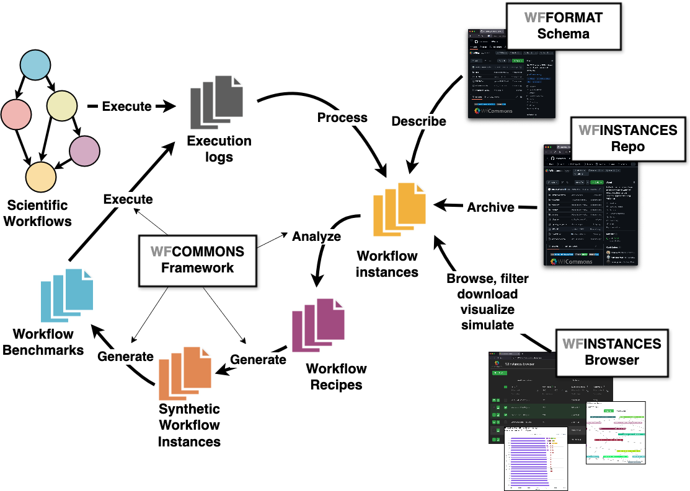

|pypi-badge| |build-badge| |license-badge|

`WfCommons <https://wfcommons.org>`__ is an open-source Python framework for
enabling scientific workflow research and development. It provides, in a single
package, everything needed to go from **real workflow executions** to
**realistic synthetic workflows** and **runnable benchmarks**: parsers that
turn execution logs into a common format, analysis tools that characterize
workflow behavior, generators that produce synthetic workflows at any scale,
and translators that emit executable benchmarks for a dozen workflow systems.

Quick links: `Documentation <https://wfcommons.readthedocs.io/en/latest/>`__ ·
`Website <https://wfcommons.org>`__ ·
`GitHub <https://github.com/wfcommons/wfcommons>`__

   The WfCommons conceptual architecture.

Why WfCommons?
==============

Research on workflow scheduling, resource provisioning, and system design
needs workflows to experiment with — many more than any single team can obtain
from production systems. WfCommons solves this problem end-to-end: it curates
real execution instances in an open format (**WfFormat**), learns their
structural and statistical properties, and reproduces them synthetically at
arbitrary scales — so experiments are realistic, repeatable, and comparable
across studies.

The framework
=============

.. grid:: 2
    :gutter: 3

    .. grid-item-card:: 📦 WfInstances — real workflow executions
        :link: analyzing_instances
        :link-type: doc

        A curated, open-access collection of production workflow executions in
        a common JSON format, plus parsers that build instances from the logs
        of Makeflow, Nextflow, Pegasus, Snakemake, TaskVine, and more.

    .. grid-item-card:: 🧑‍🍳 WfChef — workflow recipes
        :link: generating_workflows_recipe
        :link-type: doc

        Automatically discovers the recurring subgraph patterns and
        statistical task profiles of a workflow application and packages them
        as a reusable *recipe* — no manual modeling required.

    .. grid-item-card:: ⚙️ WfGen — synthetic workflow generation
        :link: generating_workflows
        :link-type: doc

        Turns a recipe into any number of realistic synthetic workflow
        instances with an arbitrary number of tasks — including scaled
        runtimes and data sizes for what-if experiments.

    .. grid-item-card:: 🏋️ WfBench — runnable benchmarks
        :link: generating_workflow_benchmarks
        :link-type: doc

        Generates workflow benchmarks with tunable CPU, memory, and I/O
        behavior, and translates them into executable code for Airflow, Dask,
        Nextflow, Parsl, Pegasus, TaskVine, and other systems.

All components speak :ref:`WfFormat <json-format-label>`, an open JSON schema
for describing workflow executions. Simulators that support WfFormat (e.g.,
`WRENCH <https://wrench-project.org>`__) can consume real and synthetic
instances interchangeably — this is the **WfSim** part of the ecosystem.

Get started in 30 seconds
=========================

.. code-block:: bash

    $ python3 -m pip install wfcommons

Generate a realistic 250-task Seismology workflow:

.. code-block:: python

    import pathlib
    from wfcommons.wfchef.recipes import SeismologyRecipe
    from wfcommons import WorkflowGenerator

    generator = WorkflowGenerator(SeismologyRecipe.from_num_tasks(250))
    workflow = generator.build_workflow()
    workflow.write_json(pathlib.Path("seismology-workflow.json"))

Where to go next:

- :doc:`quickstart_installation` — installation and first steps.
- :doc:`introduction` — how the components fit together, and WfFormat.
- :doc:`analyzing_instances` — parse execution logs and analyze real instances.
- :doc:`generating_workflows_recipe` — build recipes from your own workflows.
- :doc:`generating_workflows` — generate synthetic workflows at scale.
- :doc:`generating_workflow_benchmarks` — produce runnable benchmarks.

Citing WfCommons
================

When citing WfCommons, please use the following paper (it also provides a
general overview of the framework):

.. code-block:: bibtex

    @article{wfcommons,
        title = {{WfCommons: A Framework for Enabling Scientific Workflow Research and Development}},
        author = {Coleman, Taina and Casanova, Henri and Pottier, Loic and
                  Kaushik, Manav and Deelman, Ewa and Ferreira da Silva, Rafael},
        journal = {Future Generation Computer Systems},
        volume = {128},
        pages = {16--27},
        doi = {10.1016/j.future.2021.09.043},
        year = {2022},
    }

Support
=======

The source code for the WfCommons Python package is available on
`GitHub <http://github.com/wfcommons/wfcommons>`_.
Our preferred channel to report a bug or request a feature is via WfCommons's
GitHub `Issues Track <https://github.com/wfcommons/wfcommons/issues>`_.

You can also reach the WfCommons team via our support email:
support@wfcommons.org.

.. toctree::
    :caption: Quickstart
    :hidden:
    :maxdepth: 2

    quickstart_installation.rst

.. toctree::
    :caption: User Guide
    :hidden:
    :maxdepth: 2

    introduction.rst
    analyzing_instances.rst
    generating_workflows_recipe.rst
    generating_workflows.rst
    generating_workflow_benchmarks.rst

.. toctree::
    :caption: API Reference
    :hidden:
    :maxdepth: 1

    user_api_reference.rst
    dev_api_reference.rst

.. |build-badge| image:: https://github.com/wfcommons/wfcommons/workflows/Build/badge.svg
    :target: https://github.com/wfcommons/wfcommons/actions
.. |license-badge| image:: https://img.shields.io/badge/License-LGPL%20v3-blue.svg
    :target: https://github.com/wfcommons/wfcommons/blob/master/LICENSE
.. |pypi-badge| image:: https://badge.fury.io/py/wfcommons.svg
    :target: https://badge.fury.io/py/wfcommons
