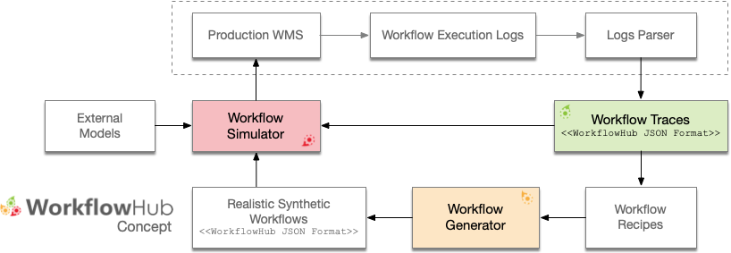

The WorkflowHub Project
=======================

The `WorkflowHub project <http://workflowhub.org>`_ is a community framework
for enabling scientific workflow research and education by providing foundational
tools for analyzing workflow execution traces, and generating synthetic, yet
realistic, workflow traces that can be used to develop new techniques, algorithms
and systems that can overcome the challenges of efficient and robust execution of
ever larger workflows on increasingly complex distributed infrastructures. The
figure below shows an overview of the workflow research life cycle process that
integrates the three axis of the WorkflowHub project:

   The WorkflowHub conceptual architecture.

The *first axis* (**Workflow Traces**) of the WorkflowHub project targets the
collection and curation of open access production workflow executions from
various scientific applications shared in a common trace format (i.e.,
:ref:`json-format-label`).

The *second axis* (**Workflow Generator**) of the WorkflowHub project targets
the generation of realistic synthetic workflow traces based on workflow execution
profiles extracted from execution traces.

The *third axis* (**Workflow Simulator**) of the WorkflowHub project fosters the
use of simulation for the development, evaluation, and verification of scheduling
and resource provisioning algorithms (e.g., multi-objective function optimization,
etc.), evaluation of current and emerging computing platforms (e.g., clouds, IoT,
extreme scale, etc.), among others.

This Python package provides a collection of tools for:

- Analyzing traces of actual workflow executions;
- Producing recipes structures for creating workflow recipes for workflow
  generation; and
- Generating synthetic realistic workflow traces.

.. _json-format-label:

The WorkflowHub JSON Format
---------------------------

The WorkflowHub project uses a common format for representing workflow execution
traces and generated synthetic workflows traces, so that workflow simulators and
simulation frameworks (that provide support for WorkflowHub format) can use
such traces interchangeably. This common format uses a JSON specification defined
available in the
`WorkflowHub JSON schema GitHub <https://github.com/workflowhub/workflow-schema>`_
repository. The current version of the WorkflowHub Python package uses the schema
version :code:`1.0`. The schema GitHub repository provides detailed explanation
of the WorkflowHub JSON format (including required fields), and also a validator
script for verifying the compatibility of traces.
