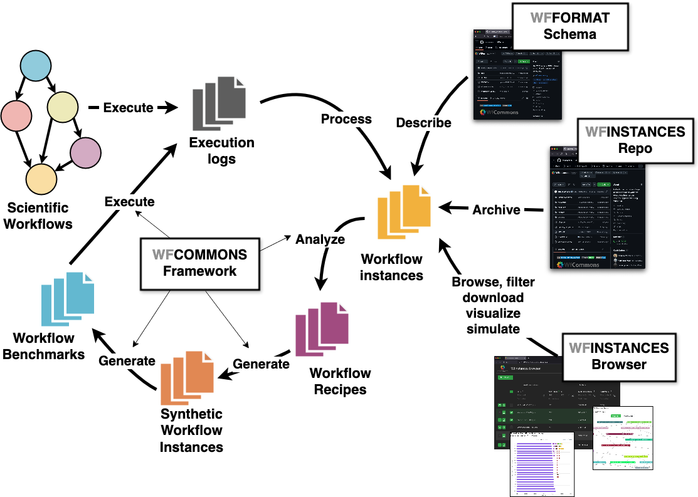

The WfCommons Project
=======================

The `WfCommons project <https://wfcommons.org>`_ is a community framework
for enabling scientific workflow research and development by providing foundational
tools for analyzing workflow execution instances, and generating synthetic, yet
realistic, workflow instances that can be used to develop new techniques, algorithms
and systems that can overcome the challenges of efficient and robust execution of
ever larger workflows on increasingly complex distributed infrastructures. The
figure below shows an overview of the workflow research life cycle process that
integrates the three axis of the WfCommons project:

   The WfCommons conceptual architecture.

The *first axis* (**Workflow Instances**) of the WfCommons project targets the
collection and curation of open access production workflow executions from
various scientific applications shared in a common instance format (i.e.,
:ref:`json-format-label`). We keep a `list of workflow execution instances
<https://wfcommons.org/instances>`_ in our project website.

The *second axis* (**Workflow Generator**) of the WfCommons project targets
the generation of realistic synthetic workflow instances based on workflow execution
profiles extracted from execution instances. We are constantly seeking for additional
workflow execution instances for refining or developing new workflow recipes for
the WfCommons's workflow generator.

The *third axis* (**Workflow Simulator**) of the WfCommons project fosters the
use of simulation for the development, evaluation, and verification of scheduling
and resource provisioning algorithms (e.g., multi-objective function optimization,
etc.), evaluation of current and emerging computing platforms (e.g., clouds, IoT,
extreme scale, etc.), among others. We keep a `list of open source workflow
management systems simulators and simulation frameworks
<https://wfcommons.org/simulation>`_ that provide support for the WfCommons
JSON format in our project website.

This Python package provides a collection of tools for:

- Analyzing instances of actual workflow executions;
- Producing recipes structures for creating workflow recipes for workflow
  generation; and
- Generating synthetic realistic workflow instances.

.. _json-format-label:

The WfCommons JSON Format
---------------------------

The WfCommons project uses a common format for representing workflow execution
instances and generated synthetic workflows instances, so that workflow simulators and
simulation frameworks (that provide support for WfCommons format) can use
such instances interchangeably. This common format uses a JSON specification
available in the
`WfCommons JSON schema GitHub <https://github.com/wfcommons/workflow-schema>`_
repository. The current version of the WfCommons Python package uses the schema
version :code:`1.1`. The schema GitHub repository provides detailed explanation
of the WfCommons JSON format (including required fields), and also a validator
script for verifying the compatibility of instances.
